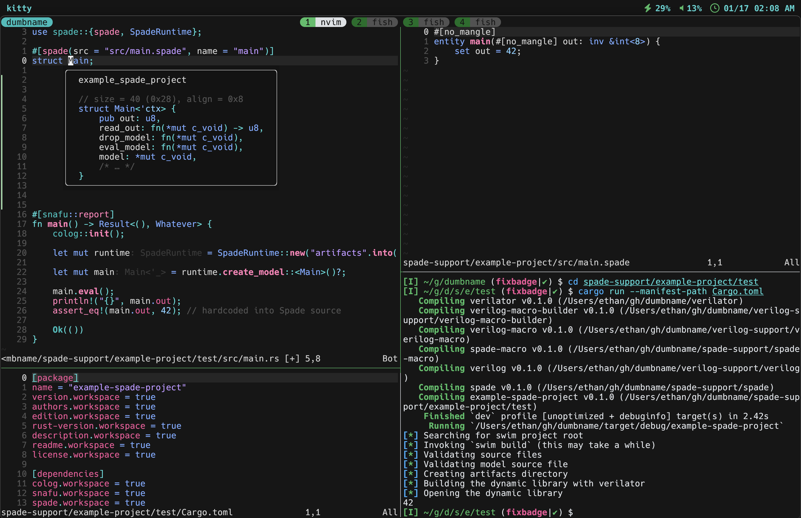

# dumbname

> [!IMPORTANT]
> I need a better name than `dumbname` --- I'm open to suggestions!

dumbname is a really powerful library (and API) that lets you "import" hardware
modules into Rust. 

No precompilation step and manual updates with `verilator` harnesses; no 
Makefiles and quirky decorators with `cocotb`.
testbenches. You're writing a regular Rust crate here.

Add this library to your `Cargo.toml` like any other library. Use hardware
modules as `struct`s like any other Rust `struct`. Hook them up to `tokio` or
`serde` even.

## 🔥 Motivation

Why does hardware testing suck? Consider the ways we have to test
(System)Verilog:

- **Test natively**: Verilog is already a terrible enough language, and writing
  tests *in* Verilog is really annoying.
- **Use verilator harnesses**: You have to first run Verilator to get the right
  headers, recompile manually every time, deal with raw pointers and C++, etc.
- **Use cocotb**: You have to use Makefiles, performance isn't the
  greatest, you get no LSP support, etc.

The problem gets worse with custom HDLs, so they've come up with some creative
solutions:

- [Calyx](https://calyxir.org): the canonical way of testing Calyx code is to
  read from JSON files representing byte arrays and write to JSON files
  representing byte arrays.
- [Spade](https://spade-lang.org): `verilator` integration involves [absurd
  macro magic](https://docs.spade-lang.org/simulation.html#verilator) and [using
  `cocotb`](https://docs.spade-lang.org/simulation.html#cocotb) requires putting the design-under-test in a code comment.
- [Veryl](https://veryl-lang.org): you literally [write inline Verilog or Python](https://doc.veryl-lang.org/book/05_language_reference/13_integrated_test.html). Yes, inside Veryl code.

Still, a lot of these are less than optimal.

## ✨ Features

- 🚀 Minimal overhead over directly using `verilator`
- 🔌 Works completely drop-in in your existing projects
- 🦀 Rust. Did I say Rust?

## ⚡️ Requirements

- [Rust](https://rustup.rs)
- [`verilator`](https://verilator.org/guide/latest/install.html)

## 📦 Install

dumbname is currently in development.
You can currently install the crates via `git` specifications.
(I'm aware that this is not explained well.)
Look at the tutorials in the Usage section for detailed instructions.

## ❓ Usage

I'll write more documentation once I get further in the development process.

- [Testing a Verilog project](./docs/testing_verilog.md)
- [Testing a Spade project](./docs/testing_spade.md)

## 💡 How it works

I'll write more on this once I get further in the development process.
The TLDR is procedural macros + `dlopen`.

## 🌎 Related

- [verilated-rs](https://github.com/djg/verilated-rs) is a super cool library
that uses a build script to statically link in verilated bindings, but is
unmaintained for years as of writing this.
